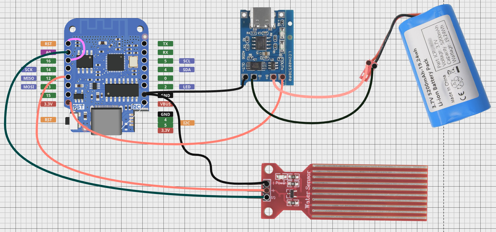
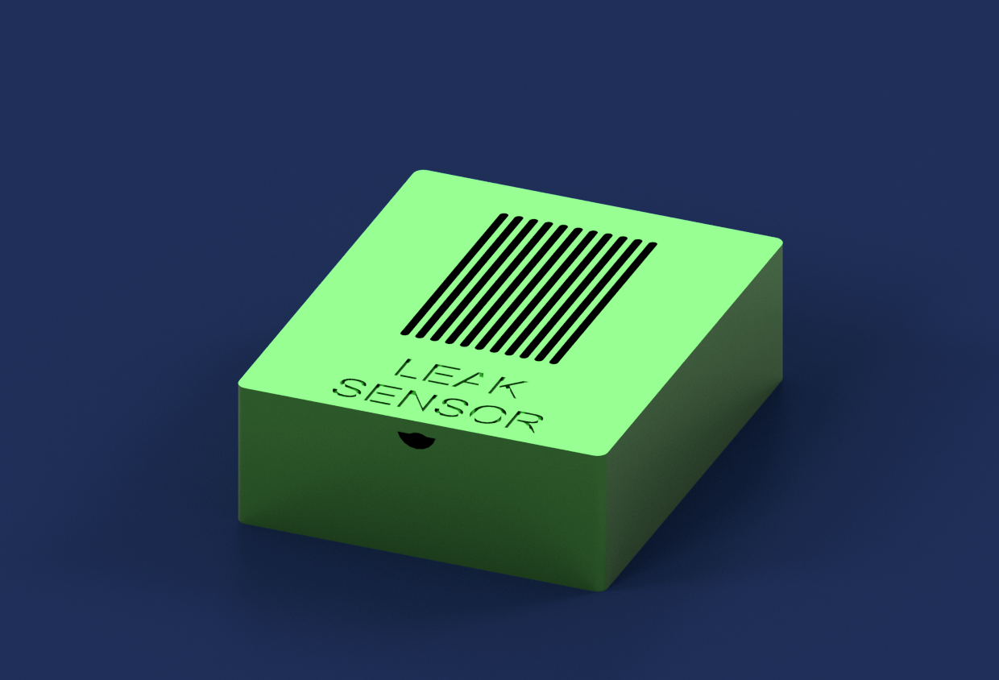
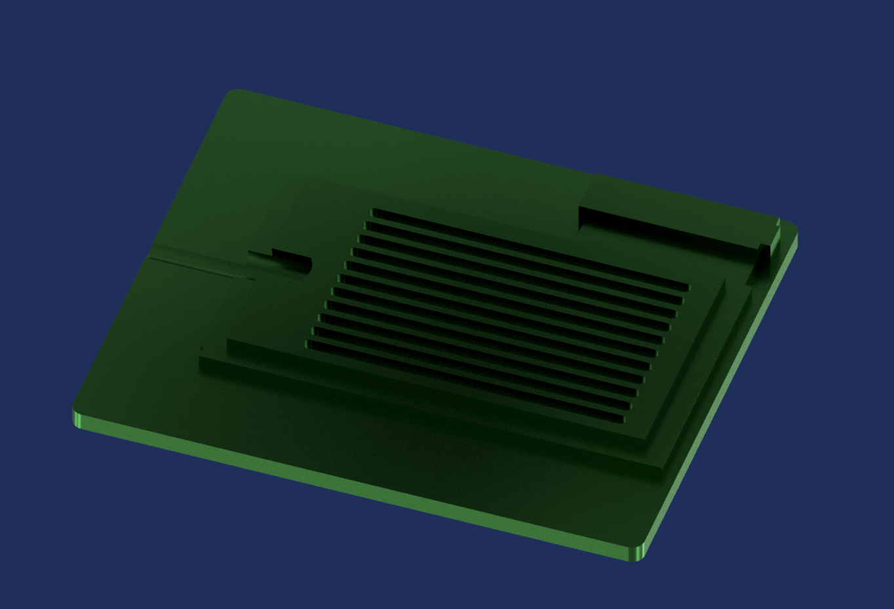

# DIY Water Sensor Project

DIY Water Sensor Project for the techy folk. Utilizes fairly cheap equipment that allows you to replicate this project multiple times for multiple purposes.

This project utilizes the resistance the water creates on the water sensor to detect how high the water has ran up the sensor. You can generally look at the output and determine less than 10 as being nearly zero, while the water resistance can be upwards of 500 when the water level is high. This project can be powered by the battery OR powered via USB-C OR both USB-C plus battery for a battery backup.

## Hardware Required
- WeMos D1 Mini V4.0.0 Type-C USB WiFi
- USB Type C Wall Charger Plug 5V 1A
- 5V 1A TP4056 Charging Module Type-C USB 18650 Lithium Battery Charger Board with Protection (Type-C USB)
- Rain Water Level Sensor Module Depth Detection Liquid Surface Height for Arduino Raspberry Pi
- 3.7V 5200mah Rechargeable Battery Pack Lithium Ion Batteries with JST-2P
- JST Connector 2 Pin with Silicone Wire Cable 150mm
- Breadboards + Cables 
- Soldering Tools & Equipment

## Features

- USB-C Friendly
- Low Power Consumption with Sleep Mode
- Easily Configurable Arduino Code for Wifi / MQTT / Sleep
- Periodic [30s] polling to publish to MQTT Server.
- Built-in docker-compose scripting to build Prometheus/Grafana stack.

## Wiring Setup
In the wiring diagram below, we can see the following requirements:

- **Wemos D1 Mini (D2) RST** ==> **Wemos D1 Mini (D2) GPIO 16**
- **Wemos D1 Mini (D2) GPIO 12** ==> **Water Sensor (Positive)**
- **Wemos D1 Mini (D2) Power (3.3V)** ==> **USB-C Charger B+ (outside power pin)**
- **Wemos D1 Mini (D2) (Ground)** ==> **Water Sensor (Ground)**
- **Wemos D1 Mini (D2) (Ground)** ==> **USB-C Charger (Outside Ground pin)**
- **USB-C Charger B+ (inside power pin)** ==> **Battery Power Pin**
- **USB-C Charger B- (inside ground pin)** ==> **Battery Ground Pin**



## Environment - Secret Variables

`WIFI_SSID` - WIFI network name for your wireless network.

`WIFI_PASSWORD` - Wireless Password

`MQTT_PUBLISH_TOPIC` - MQTT Topic Name, VERY important you name this per device. I'd suggest using this to name your device. Such as `sump_pump_basement`

`MQTT_SERVER` - IP / Hostname of your MQTT Server / VM

`MQTT_USER` - If applicable, username of the MQTT user account to publish data to the server. Leave an empty string or placeholder text if the user is not required.
 
`MQTT_PASSWORD` - If applicable, the password of the MQTT user account to publish data to the server. Leave an empty string or placeholder text if the user is not required.


## Installation

### Arduino Setup

Install the dependencies in order to run the Arduino code.

- Add the following Libraries to the Arduino IDE in preferences -> Additional Board Manager URLs.

    - `https://arduino.esp8266.com/stable/package_esp8266com_index.json`

    - `https://raw.githubusercontent.com/espressif/arduino-esp32/gh-pages/package_esp32_dev_index.json`

- Connect your USB-C cable to your computer, and choose the COM Port for your device. Then select the board `LOLIN (WEMOS) D1 R2 & Mini`. 

### Case - 3D Printable
See the images below for the fusion 360 generated views. The case snaps together snugly so it should hold up well.
The folder [stls] contains the stl printable files you can use. In my case I printed without supports using an X1C, flipping the parts on the appropriate faces to avoid supports.




### Monitoring Stack Setup
Apply the steps below for your OS. I'm using a Virtualized Ubuntu, but you can lookup steps for any OS you want to run this on. Alternatively, you can throw this project into Kubernetes which I may do later on.

#### Ubuntu - Install Scripts
```bash
  sudo apt install docker
  sudo apt install docker-compose
  
```
## Deployment

To deploy MQTT + MQTT Exporter + Prometheus + Grafana run

```bash
  docker-compose -f ./monitoring-compose.yml up -d

  
```


## Authors

- [@Aetrius](https://www.github.com/aetrius)
- [@SmartThingsDIY](https://github.com/SmartThingsDIY/wemos-water-leak-sensor)

## Acknowledgements
This project was cloned from [SmartThingsDIY](https://github.com/SmartThingsDIY/wemos-water-leak-sensor?tab=readme-ov-file) with some significant modifications.

